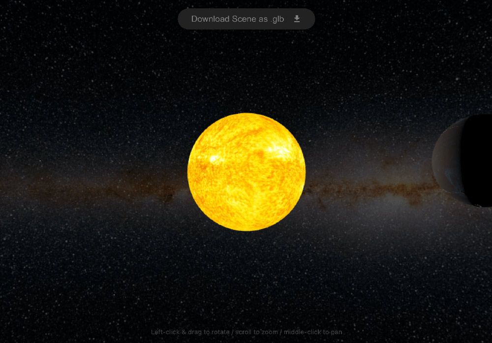

# Coding Challenge - Babylon.js Earth & Sun Animation 



## Overview
This project simulates Earth's orbit around the Sun, complete with an asteroid shower. It was developed using Babylon.js and React.

## Features
- **Download Scene**: Users can download the scene as a .glb model.
- **Unit Sizes**: Sun is scaled to fit 2x2x2 box and Earth is scaled to fit 1x1x1 box
- **Earth's Tilt**: Earth's tilt accurately modeled.
- **Asteroids**: Asteroids created via an InstancedMesh move dynamically with controlled randomness.
- **Visual Environment**: Includes a galaxy skybox and PointLighting eminating from the Sun.


## Note on Earth's Daily Rotation

Given the highly sped-up nature of the animation, adding an accurate daily rotation would have created a dizzying effect that detracted from the overall experience.

If you do want to implement it, you can include the following code snippet in the Earth component:

```// Earth's daily rotation animation
const rotationAnimation = new Animation(
  'rotation',
  'rotation.y',
  60,
  Animation.ANIMATIONTYPE_FLOAT,
  Animation.ANIMATIONLOOPMODE_CYCLE,
);
const rotationKeys = [];
for (let frame = 0; frame <= 360; frame += 10) { 
  const angle = (frame * 365.24 * 2 * Math.PI) / 360;
  rotationKeys.push({ frame, value: angle });
}
rotationAnimation.setKeys(rotationKeys);
mesh.animations.push(rotationAnimation);
animationGroup.addTargetedAnimation(rotationAnimation, mesh);
```

## Installation
1. Clone the repository
2. Run `npm install`
3. Run `npm start`
4. Navigate to `http://localhost:3000`